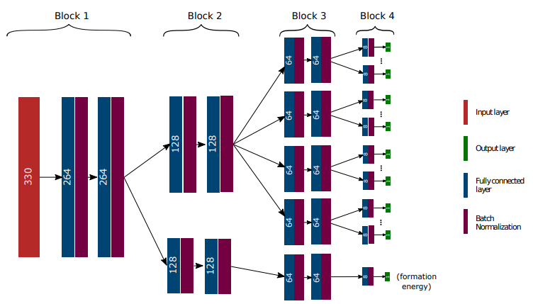

# MODNet: Material Optimal Descriptor Network

## Table of contents
- [Introduction](#introduction)
- [How to install](#install)
- [Usage](#usage)
- [Pretrained models](#pretrained)
- [Stored MODData](#stored-moddata)
- [Documentation](#documentation)
  - [MODData](#moddata)
  - [MODNetModel](#modnetmodel)
- [Author](#author)
- [License](#license)


<a name="introduction"></a>
## Introduction
This repository contains the python package implementing the Material Optimal Descriptor Network (MODNet). It is a supervised machine learning framework for **learning material properties** from the **crystal structure**. The framework is well suited for **limited datasets** and can be used for learning *multiple* properties together by using **joint transfer learning**.

This repository also contains two pretrained models that can be used for predicting the refractive index and vibrational thermodynamics for any crystal structure.

See paper for more details: [Machine learning materials properties for small datasets](https://arxiv.org/abs/2004.14766)


<div align='center'><strong>Figure 1. Schematic representation of the MODNet.</strong></div>


<a name="install"></a>
## How to install

MODNet can be installed via pip:

```bash
pip install modnet
```


<a name="usage"></a>
## Usage

The MODNet package is built around two classes: `MODData` and `MODNetModel`.

The usual workflow is as follows:
```python
from modnet.preprocessing import MODData
from modnet.models import MODNetModel

# Creating MODData
data = MODData(structures,targets)
data.featurize()
data.feature_selection(self,n=1000)

# Creating MODNetModel
model = MODNetModel(target_hierarchy,weights,num_neurons=[[256],[64,64],[32]])
model.fit(data)

# Predicting on unlabeled data
data_to_predict = MODData(new_structures)
data_to_predict.featurize()
df_predictions = model.predict(data_to_predict) # returns dataframe containing the prediction on new_structures


```
Example notebooks can be found in the *example_notebooks* directory.


<a name="pretrained"></a>
## Pretrained models
Two pretrained models are provided in *pretrained/*:
 - Refractive index
 - Vibrational thermodynamics

Download this directory localy to *path/to/pretrained/*.
Pretrained models can then be used as follows:

```python
from modnet.models import MODNetModel

model = MODNetModel.load('path/to/pretrained/refractive_index')
# or MODNetModel.load(path/to/pretrained/vib_thermo)
```

<a name="stored-moddata"></a>
## Stored MODData

Three `MODData`s are provided in *moddata/*:
- Refractive index
- Vibrational thermodynamics
- Formation energy on Materials Project (June 2018)

Download this directory localy to *path/to/moddata/*. These can then be used as follows:

```python
from modnet.preprocessing import MODData

data_MP = MODData.load('path/to/moddata/MP_2018.6')

```

The latter MODData (MP_2018.6) is very usefull for predicting a learned property on all structures from the Materials Project:

```python
predictions_on_MP = model.predict(data_MP)
```

<a name="documentation"></a>
## Documentation
The two main classes, `MODData` and `MODNetModel`, are detailed here.

<a name="moddata"></a>
### MODData

A `MODData` instance is used for represtening a particular dataset. It contains a list of structures and corresponding properties:

```python
from modnet.preprocessing import MODData

data = MODData(structures,targets,names=[],mpids=[])
```

**Arguments:**
- `structures (List)`: List of pymatgen Structures.
- `targets (List)`: List of targets corresponding to each structure. When learning on multiple properties this is a list of lists, where each inner list is the ensemble of properties for a given structure.
- `names (List)` *(optional)*: List of names corresponding to the properties. E.g. ['S_300K','S_800K',...] or ['refractive_index'] for single target learning. These names are used when building the model.
- `mpids (List)`*(optional)*: If the list of structures (`structures`) are from the Materials Project, you can specify the corresponding mpids by providing a list of mpids: ['mp-149','mp-166',...]. This will enable fast featurization (see further).


The next step is to create the features:

```python
data.featurize(self,fast=False,db_file='feature_database.pkl')
```
**Arguments:**
- `fast (Boolean)` *(optional)*: If set to True, the algorithm will use the pre-computed features from a database instead of computing them again from scratch. This is recommended (and only possible) when using structures from the Materials Project. Note that the mpids should be provided in the MODData.
- `db_file (Boolean)` *(optional)*: When setting fast to True, you also need to provide this argument. Download the file at *modnet/data/feature_database.pkl*, then set the local path to this file as argument.

Finally, the optimal features are computed:

```python
data.feature_selection(self,n=300)
```

**Arguments:**
- `n`*(optional)*: Number of optimal features to compute, i.e. the n first ranked features are computed. When set to -1, all features are ranked (recommended, but can take time).

The MODData can be saved,

```python
data.save('path/dataname')
```

and loaded for later usage:

```python
from modnet.preprocessing import MODData

data = MODData.load('path/dataname')
```

Features, targets and other data can be accesed trough the following methods:


```python

# dataframe containing the structures
data.get_structure_df():

# dataframe containing the targets
data.get_target_df():

# dataframe containing the features
data.get_featurized_df():

# List of the optimal features, in ranked order
data.get_optimal_descriptors():
    
# get_featurized_df limited to the best features
data.get_optimal_df():
```


<a name="modnetmodel"></a>
### MODNetModel


<div align='center'><strong>Figure 2. Example architecture of the MODNet.</strong></div>

The model is created by a MODNetModel instance:

```python
from modnet.models import MODNetModel

model = MODNetModel(targets,weights,num_neurons=[[64],[32],[16],[16]], n_feat=300, loss='mse',act='relu')
```

**Arguments:**
- `targets (List)`: Specifies how the different targets are organized in the architecture. It is a list of lists of lists, representing the three modular last levels: block 2, 3 and 4 (see Figure 2). Each block gathers properties, which are put inside the same list. For exmaple, in Figure 2, this is [[['S_5,...,S_800'],['U_5,...,U_800'],['C_v_5,...,C_v_800'],['H_5,...,H_800']],[['formation_energy']]]. The same names as given in `MODData` should be used.

- `weights (Dictionary)`: A dictionary where each key is a property name and the value the corresponding weight to be used in the loss function. The weights are used to scale the different outputs such that the balance between the properties is conserved when training. For example, {'S_5':0.01, 'formation_energy:1'}.


- `num_neurons (List)` *(optional)*: Number of neurons as well as the number of layers to be used in the neural network. List of three lists. Each inner list gives respectively the succesive number of neurons of the blocks 2, 3 and 4. For example, in Figure 2, this is given by [[128,128],[64,64],[8]].
- `n_feat (int)` *(optional)*: Number of optimal features to be used in the model. In Figure 2, this is 330.
- `loss (String)`*(optional)*: Loss function of the neural network, see Keras API.
- `act (String)` *(optional)*: Activation function used in the neural network, see Keras API.


The model is then fitted on the data:


```python
model.fit(data, val_fraction = 0.0, val_key = None, lr=0.001, epochs = 200, batch_size = 128, xscale='minmax'):
```

**Arguments:**
- `val_fraction (float)` *(optional)*: Validation fraction to be used while training.
- `val_key (String)` *(optional)*: The name of the property used for printing validation MAE. When multiple properties are learned (e.g. ['formation energy','refractive_index','entropy']), setting the key_val (e.g. key_val = 'entropy') will only print the MAE of this property for each epoch.
- `lr (float)` *(optional)*: Learning rate.
- `epochs (int)` *(optional)*: Number of epochs.
- `batch_size (int)` *(optional)*: Batch size.
- `xscale (String)` *(optional)*: Scaling of the features. Possible values: 'minmax' or 'standard'.


You can save and load the model for later usage:

```python
model.save('path/modelname')
```

```python
from modnet.models import MODNetModel
MODNetModel.load('path/modelname')
```

Prediction is done by first creating a MODData instance on the new data:

```python
data_to_predict = MODData(structures, mpids = df.index) # Adding mpids is a good idea for fast featurization, but not necessary.
data_to_predict.featurize(fast=True)
```

and then using the predict method:

```python
df_predictions = model.predict(data_to_predict)
```
A dataframe containing the predictions is returned.


<a name="author"></a>
## Author
This software is written by [Pierre-Paul De Breuck](mailto:pierre-paul.debreuck@uclouvain.be)

<a name="License"></a>
## License
MODNet is released under the MIT License.


