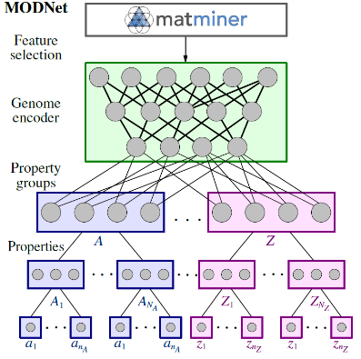

.. modnet documentation master file, created by
   sphinx-quickstart on Wed Mar  3 12:10:12 2021.
   You can adapt this file completely to your liking, but it should at least
   contain the root `toctree` directive.

Welcome to modnet's documentation!
==================================

modnet is a Python (3.8+) package implementing the Material Optimal Descriptor Network (MODNet).
It is a supervised machine learning framework for **learning material properties** from
either the **composition** or  **crystal structure**. The framework is well suited for **limited datasets**
and can be used for learning *multiple* properties together by using **joint transfer learning**.

This repository also contains two pretrained models that can be used for predicting
the refractive index and vibrational thermodynamics from any crystal structure.

See the MODNet papers and repositories below for more details:

- *Machine learning materials properties for small datasets*, De Breuck *et al.* (2020), `arXiv:2004.14766 <https://arxiv.org/abs/2004.14766)>`_.

- *Robust model benchmarking and bias-imbalance in data-driven materials science: a case study on MODNet*, De Breuck *et al.* (2021), `arXiv:2102.02263 <https://arxiv.org/abs/2102.02263>`_.

- Matbench benchmarking data repository: `ml-evs/modnet-matbench <https://github.com/modl-uclouvain/modnet-matbench>`_.

.. toctree::
   :maxdepth: 4
   :caption: Contents:

   install
   getting-started
   api
   support

Indices and tables
==================
* :ref:`genindex`
* :ref:`modindex`
* :ref:`search`
